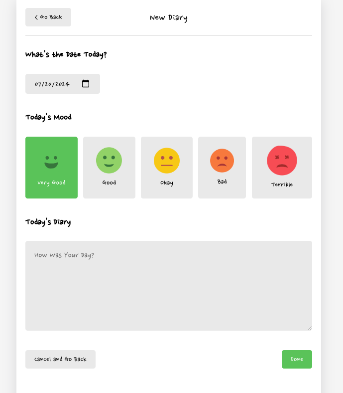

# Daily Diary App
## Overview
* This project is a simple frontend application built using JavaScript, React.js, and React Hooks. The primary goal of this project is to explore and implement the latest features of React, specifically React Hooks, which provide a powerful and flexible way to handle state and side effects in functional components.
* It allows users to create, edit, and delete diary entries with associated moods.
* This application is designed to help users track their daily feelings and activities.

# Stack
* React(+Hook)
* JavaScript

## How to start

In the project directory, you can run:

### `npm start`

Runs the app in the development mode.\
Open [http://localhost:3001](http://localhost:3000) to view it in your browser.


# Learning 
- [Note]
* ## React Hooks
* React Hooks are functions that let you use state and other React features without writing a class. Some of the essential hooks include:

    * useState: Allows you to add state to functional components.
        ```
        const [isEdit, setIsEdit] = useState(false);
        ```
        * Purpose: isEdit is a boolean state used to track whether the diary item is in edit mode.
        * Initial Value: The initial value is false, meaning the diary item is not in edit mode initially.
        * State Update Function: setIsEdit is the function used to update the isEdit state.

        ```
        EX>
        const toggleIsEdit = () => setIsEdit(!isEdit);

        ```
    * useEffect: Lets you perform side effects in functional components, such as data fetching, subscriptions, or manually changing the DOM. useEffect serves a similar purpose to lifecycle methods like componentDidMount.
        ```
        // useEffect to initialize the form fields when in edit mode
        useEffect(() => {
            if (isEdit) {
            setDate(getStringDate(new Date(parseInt(originData.date))));
            setEmotion(originData.emotion);
            setContent(originData.content);
            }
        }, [isEdit, originData]); 
        // Dependencies: runs effect when isEdit or originData changes
        ```
    * useContext: Provides a way to pass data through the component tree without manually passing props down at every level.
        ```
          const diaryList = useContext(Diarystatecontext);
        ```
    * useReducer: An alternative to useState for managing complex state logic.
        ```
        const reducer =  ( state, action ) =>{
            let newState = [];
            switch(action.type){
                case 'INIT':{
                return action.data;
                }
                case 'CREATE':{
                const newItem = {
                    ...action.data
                };
                newState = [newItem, ... state];
                break;
                }
                case 'REMOVE':{
                newState = state.filter((it) => it.id !== action.targetId);
                break;
                }
                case 'EDIT':{
                newState = state.map((it)=>
                it.id === action.data.id ? { ...action.data } : it
                );
                break;
                }
                default:
                return state;
            }
            ---
            const [data, dispatch] = useReducer(reducer, dummyData);
            ---
            dispatch({type:"INIT" , data:diaryList});

        ```
# Features

* ## Main Page
    
* #### Navigating Monthes
    * Users can select a month using the arrows on the top left/right.
* #### Write Diary
    * Users can choose a 'Create New Diary' button to write a diary.
* #### Displaying the Diarys
    * Displaying monthly list of Diary.
* #### Filters
    * Time
        * The Lastest / Oldest
    
    * Mood Tracking
        * Users can select a mood for each entry from five options.
    
* ## Diary Page
    
    * Create New Diary Entry
        * Users can create new diary entries by selecting a date, choosing a mood, and writing their thoughts.

* ## Edit & Delete Diary
    * Delete Diary Entry
        * Users can delete unwanted diary entries.
    * Edit Diary Entry
        * Users can edit existing diary entries to update the date, mood, or diary content.
    

[Note]: https://velog.io/@sigint_107/%ED%94%84%EB%A1%A0%ED%8A%B8-%ED%94%84%EB%A1%9C%EC%A0%9D%ED%8A%B8React%EC%97%90%EC%84%9C-%EC%BB%B4%ED%8F%AC%ED%8A%B8%EB%8D%B0%EC%9D%B4%ED%84%B0-%EA%B5%AC%EC%A1%B0-%EC%83%9D%EA%B0%81%ED%95%B4-%EB%B3%B4%EA%B8%B0